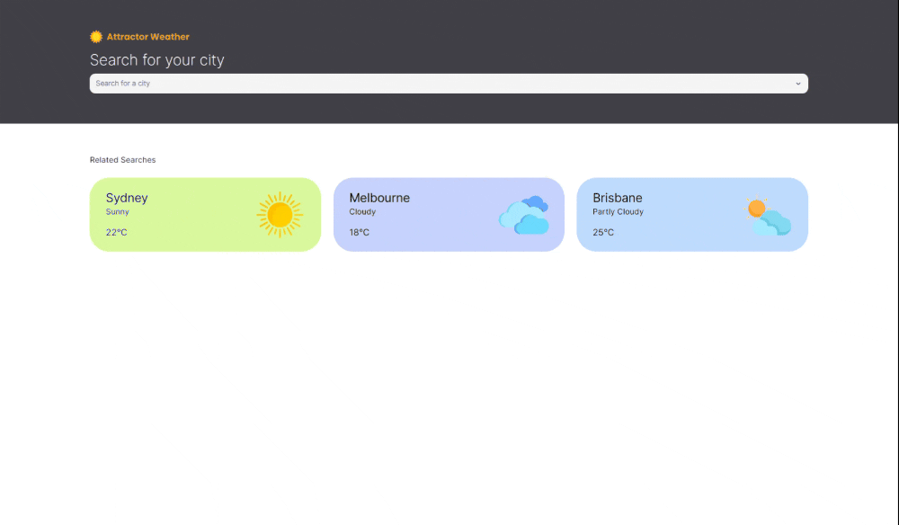

# Attractor Weather Web App

## Mobile Preview


## Desktop Preview



This is the front end web app written with Next.js, Tailwind and Typescript for a Attactor weather app as a developer challenge.

## Getting Started

Install node modules by running,

```
npm install
```

Create a `.env.local` file from the `.env.sample` to configure environment variables.

run the development server:

```bash
npm run dev
```

Open [http://localhost:3000](http://localhost:3000) with your browser to see the result.

